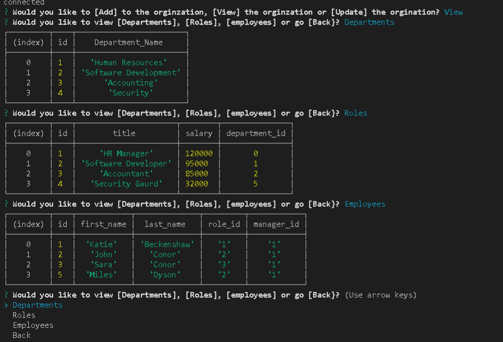

# Employee and Orgnizational Tracking System.

## Description

Node JS and MySQL system to track employees, departments, and occupational roles within an organization.

     
  - [Description](#description)
  - [Installation](#installation)
  - [Usage](#usage)
  
## Installation

The Code Requires Node JS and MySQL. It also depends on inquirer. 

## Usage

Add, Remove and Update Employees. Add Departments and Roles then assign them to employees.

